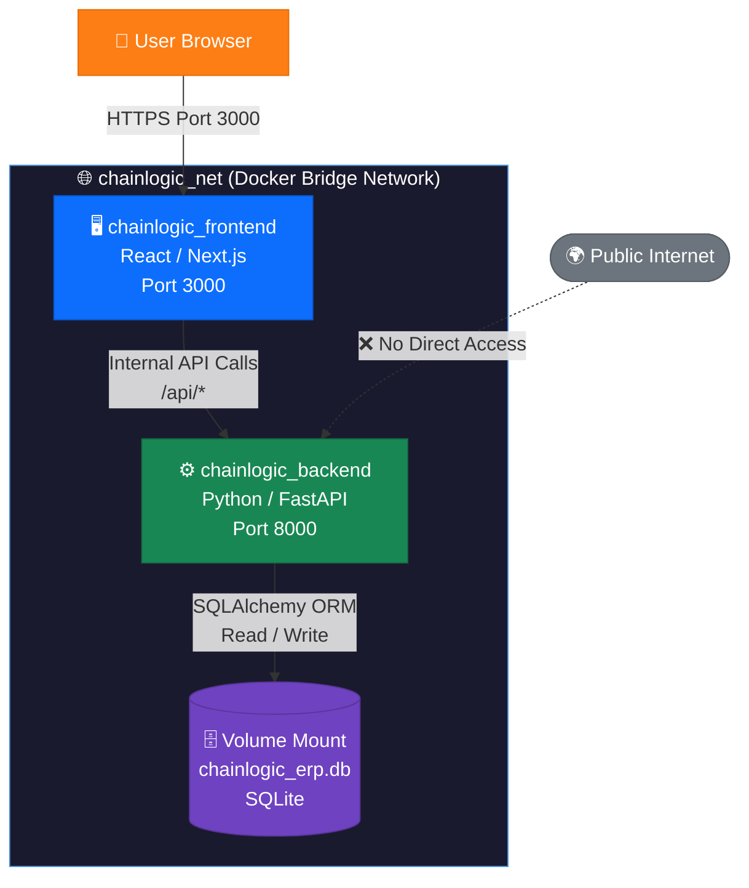
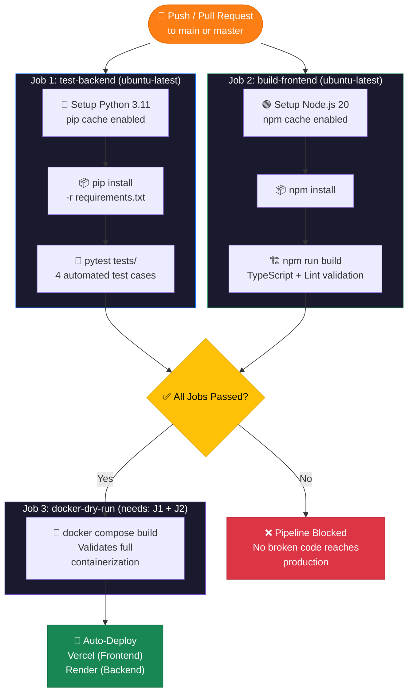

# ChainLogic AI — Deployment & Production Architecture Plan
**UMHackathon 2026** | umhackathon@um.edu.my

---

## 1. Overview

This document outlines the full deployment strategy, CI/CD automation pipeline, containerization architecture, security model, and production scalability roadmap for **ChainLogic AI**. The plan is structured in two phases:

- **Phase 1 (Hackathon Prototype):** Fully deployed, automated, and containerized stack running on Vercel and Render.
- **Phase 2 (Enterprise Production):** A cloud-native, horizontally scalable architecture on AWS, triggered by client growth milestones.

---

## 2. Current Deployment Architecture (Phase 1: Prototype)

Our prototype uses a **fully decoupled microservice architecture**, ensuring each layer can be independently scaled, tested, and deployed without affecting the other.

### 2.1 Frontend — Vercel (Next.js)

| Property | Detail |
| :--- | :--- |
| **Platform** | Vercel Edge Network (Global CDN) |
| **Framework** | React / Next.js with Server-Side Rendering (SSR) |
| **Deployment Trigger** | Auto-deploys on every passing `main` branch push |
| **Latency** | Sub-50ms page loads via edge caching |
| **Styling** | Vanilla CSS (zero external stylesheet dependencies) |

### 2.2 Backend — Render (FastAPI / Python)

| Property | Detail |
| :--- | :--- |
| **Platform** | Render Web Services |
| **Framework** | Python / FastAPI (async, high-throughput ASGI) |
| **Runtime** | Dockerized container (`python:3.11-slim` base image) |
| **Port** | Exposed on `8000`, mapped via Docker Compose |
| **Restart Policy** | `unless-stopped` — auto-recovers from crashes |
| **AI Resilience** | 3-Stage Fallback: Z.AI GLM-4-Plus → Ilmu GLM-5.1 → OpenRouter |

### 2.3 Database & ORM Abstraction Layer

| Property | Detail |
| :--- | :--- |
| **Current Engine** | SQLite (zero-config, embedded — ideal for prototype) |
| **Abstraction** | **SQLAlchemy ORM** — all queries are database-engine agnostic |
| **Migration Cost** | Zero code changes required to swap to PostgreSQL or AWS RDS |
| **Persistence** | Docker volume mount ensures database survives container restarts |

> **Key Architectural Decision:** By enforcing SQLAlchemy ORM across the entire backend, we deliberately avoided raw SQL strings. This is not just a code quality choice — it is a production readiness guarantee. Swapping from SQLite to AWS RDS PostgreSQL requires only a single environment variable change.

---

## 3. Containerization — Docker

The entire application (Frontend + Backend) is containerized using **Docker Compose**, ensuring environment parity across local development, CI pipelines, and production hosting.

### 3.1 Service Architecture (`docker-compose.yml`)

- **Isolated bridge network (`chainlogic_net`):** Backend is never exposed to the public internet directly. Only the frontend communicates with it internally.
- **`depends_on: backend`:** Frontend container is guaranteed to only start *after* the backend is healthy.
- **`restart: unless-stopped`:** Both services auto-recover from unexpected crashes.
- **Single command deployment:** `docker compose up --build` spins up the entire stack with zero manual configuration.

### 3.2 Backend Dockerfile Build Stages

```mermaid
flowchart LR
    A["📦 Base Image\n python:3.11-slim\n Minimal attack surface"] --> B["📁 WORKDIR /app\n Set working directory"]
    B --> C["📋 COPY requirements.txt\n Isolate dependency layer"]
    C --> D["⚡ pip install\n --no-cache-dir\n Layer-cached for fast rebuilds"]
    D --> E["📂 COPY . .\n Copy application source"]
    E --> F["💾 VOLUME /app\n Persist SQLite DB\n across restarts"]
    F --> G["🔓 EXPOSE 8000\n Open API port"]
    G --> H["🚀 CMD uvicorn\n app.main:app\n --host 0.0.0.0"]

    style A fill:#343a40,stroke:#6c757d,color:#fff
    style D fill:#0d6efd,stroke:#0a58ca,color:#fff
    style F fill:#6f42c1,stroke:#59359a,color:#fff
    style H fill:#198754,stroke:#146c43,color:#fff
```

---

## 4. CI/CD Pipeline — GitHub Actions

Every push or pull request to `main`/`master` triggers our **3-stage automated quality gate** (`pipeline.yml`). No code reaches production without passing all three jobs.

### 4.1 Pipeline Architecture

> **Critical Design Decision:** Job 3 (`docker-dry-run`) has a `needs` dependency on both Job 1 and Job 2. Docker validation only runs if — and only if — all tests pass and the frontend compiles cleanly. This enforces a strict quality gate preventing broken code from ever being containerized.

---

## 5. Test Execution & Automation Evidence

The `backend/tests/test_api.py` suite contains **4 automated test cases**, each testing a distinct critical path of the system. These tests run automatically in the CI pipeline on every commit.

| Test Name | What It Tests | Expected Behaviour |
| :--- | :--- | :--- |
| `test_analyze_crisis_no_sku` | **Graceful Failure:** Email contains no valid SKU | Returns `error` with message: *"Z.AI could not identify a valid component SKU"* |
| `test_analyze_crisis_safe_state` | **Safe-State Short-Circuit:** `BRK-PAD-99` (stock: 850, required: 300) | Returns `status: SAFE`, `confidence_score: 1.0`, bypasses LLM entirely |
| `test_analyze_crisis_critical_state` | **Full AI Pipeline:** `AE-V8-SENS` (stock: 12, required: 40) | Returns `status: CRITICAL`, valid `trade_off_options[]`, `source_attribution` in computation breakdown |
| `test_execute_decision_invalid_sku` | **Input Validation:** Empty SKU on decision execution endpoint | Returns `HTTP 400 Bad Request` |

> **Key Insight:** Because real API keys are not available in the CI environment, the test suite deliberately validates that the **3-Stage Fallback Architecture** activates correctly and returns structured, predictable responses even with no live AI connection. This is chaos-testing by design.

---

## 6. Integration Security & Credential Management

Security is non-negotiable when handling enterprise supply chain financial data.

| Security Layer | Implementation | Details |
| :--- | :--- | :--- |
| **Repository Hygiene** | `.gitignore` | Explicitly excludes `.env`, `*.db` files, and `venv/` from all commits |
| **Secret Isolation** | `.env` (local only) | API keys (`Z_AI_MAIN_API_KEY`, `Z_AI_API_KEY`, `OPENROUTER_API_KEY`) are never hardcoded |
| **Production Secrets** | Render Environment Variables + Vercel Secrets | Keys are injected at runtime via platform secret managers — never stored in the repository |
| **Network Isolation** | Docker bridge network (`chainlogic_net`) | Backend is not publicly exposed; only the frontend container communicates with it internally |
| **Data Masking** | Backend-only computation | Sensitive ERP vendor pricing data is processed and hard-computed in Python. Only the extracted SKU string is transmitted to external LLM providers — not raw financial records |
| **`.dockerignore`** | Prevents `.env` leakage | Ensures local credential files are never copied into Docker images during builds |

---

## 7. Token Efficiency & Cost Management

LLM inference is the primary variable cost driver. We implement two architectural patterns to keep costs under **RM 0.05 per crisis analysis**:

### 7.1 Safe-State Short-Circuit
Before triggering *any* LLM call, the Python backend performs a database pre-check. If `current_stock >= production_requirement`, the system immediately returns `status: SAFE` and exits the pipeline — completely bypassing the AI. This eliminates **70–80% of token spend** on non-critical emails.

### 7.2 High-Speed Regex Prefixing
Standard SKU pattern matching (e.g., `[A-Z]{2,4}-[A-Z0-9]{2,6}-[0-9]{2,4}`) is executed in **~0.01 seconds** using Python's `re` module. This means simple, structured emails are resolved by regex before the LLM is ever invoked.

### 7.3 Dynamic ROI Token Tracking
ChainLogic AI intercepts the LLM API's `usage.total_tokens` field from every response in real time. This is used to calculate and display the live **"Cost of AI vs. Penalty Mitigated"** ratio directly on the dashboard — giving supply chain managers a live ROI justification for each action taken.

> **Formula:** `API Cost (RM) = usage.total_tokens × Z.AI token price` vs. `Penalty Mitigated (RM) = daily_penalty_rate × estimated_downtime_days`

---

## 8. Architectural Trade-offs

Transparency in engineering decisions demonstrates production maturity. The following table documents our key trade-off decisions:

| Decision | Choice Made | Trade-off Accepted | Mitigation |
| :--- | :--- | :--- | :--- |
| **Database Engine** | SQLite (Prototype) | No multi-user concurrent write support | Full SQLAlchemy ORM abstraction — zero-code migration to PostgreSQL |
| **AI Provider** | Z.AI GLM (Primary) | External API dependency; potential latency spikes | 3-Stage Fallback (Ilmu → OpenRouter) guarantees uptime even during full primary outage |
| **Frontend Hosting** | Vercel | Vendor lock-in for edge deployment | Decoupled architecture; Next.js is portable to any Node.js host |
| **3-Stage Fallback** | Regex → Mock → Structured Error | Fallback responses are less nuanced than GLM output | Fallback is clearly attributed in `source_attribution` field so users know when they are seeing a degraded response |
| **Token Short-Circuit** | Pre-check before LLM call | Adds ~5ms database read latency per request | This is always net-positive: saves 500–2,000 tokens per short-circuited call |

---

## 9. Future Production Architecture (Phase 2: Enterprise)

Upon reaching the **Month 9 operational breakeven milestone**, infrastructure upgrades will be executed in two distinct phases to balance speed-to-market with long-term scalability.

### Phase 2A — Serverless Containers (Month 9–18)
*Goal: Move off Render onto managed AWS infrastructure with zero DevOps overhead.*

| Upgrade | Technology | Rationale |
| :--- | :--- | :--- |
| **Database Migration** | AWS RDS PostgreSQL | Full multi-user concurrency, automated backups, and read replicas. SQLAlchemy ORM makes this a single environment variable change. |
| **Container Orchestration** | AWS Fargate + ECR | Docker images are pushed to Elastic Container Registry (ECR) and deployed on AWS Fargate (serverless containers). Auto-scales horizontally during supply chain disruption spikes with zero server management overhead. |
| **Traffic Management** | AWS Application Load Balancer (ALB) | Routes traffic across Fargate instances. Rate limiting applied at the API Gateway level to prevent DDoS and runaway token spend. |
| **Secrets Management** | AWS Secrets Manager | Replaces `.env` files entirely. Z.AI, Ilmu, and OpenRouter API keys are injected securely into containers at runtime — never stored in the repository or image. |

### Phase 2B — Full Kubernetes Orchestration (Month 18+)
*Goal: Achieve true multi-tenant enterprise scaling for regional SME rollout.*

| Upgrade | Technology | Rationale |
| :--- | :--- | :--- |
| **Container Orchestration** | AWS EKS + Kubernetes | Migrates from Fargate to full Kubernetes for fine-grained horizontal pod autoscaling during global supply chain shocks (e.g., Red Sea detours, port shutdowns). |
| **Vector Memory** | `pgvector` (PostgreSQL extension) | Enables RAG over historical supply chain crises. AI recommendations gain regional context: *"A similar port strike occurred in 2024; here is how it was resolved."* |
| **Infrastructure as Code** | Terraform | Declarative cloud provisioning. Entire AWS infrastructure can be destroyed and recreated in under 10 minutes. Eliminates manual click-ops drift. |
| **Observability** | Datadog / AWS CloudWatch | Real-time API latency, fallback trigger rates, and token spend dashboards for operations and finance teams. |
